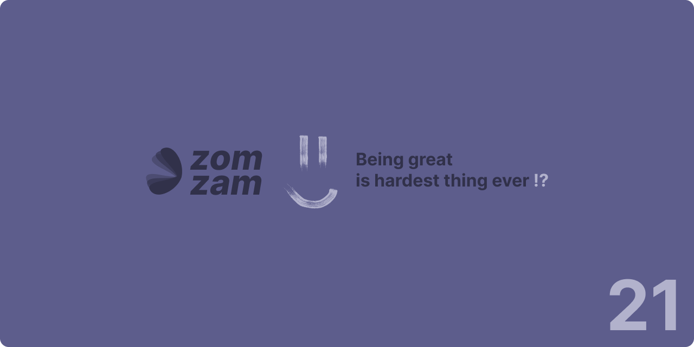

  

<h1 align="center">Ahmed Abdelaziz Hanafy (Sanfor)</h1>
<h3 align="center">Software Developer / Technical Operations Specialist</h3>

  

  
  
  

---

## 👋 About Me

Hey! I'm **Ahmed Abdelaziz**, but you can call me **Sanfor**. I'm the founder of **zomzam**, where we help small and mid-sized businesses protect themselves from security threats and automate their workflows.

I'm a Software Developer with hands-on experience in **HTML**, **CSS**, **JavaScript**, **PHP**, **Python**, and **C/C++**. But I don't just code—I'm also deeply involved in the design process, crafting intuitive **UI/UX in Figma** for every project. Plus, I love to draw, which gives me a unique perspective when building user-friendly interfaces.

Whether it's building secure systems or designing beautiful experiences, I'm all about helping businesses work smarter and safer.

---

## 🛠️ Technologies & Skills

  

### Programming Languages
- **Frontend:** HTML5, CSS3, JavaScript
- **Backend:** PHP, Python, C/C++
- **Design:** Figma (UI/UX Design)

### Core Competencies
- **Web Development:** Full-stack web application development
- **Security Solutions:** Threat protection and secure system design
- **Workflow Automation:** Business process automation
- **UI/UX Design:** User interface and experience design
- **Creative Design:** Visual design and illustration

---

## 💼 Professional Experience

### **Business Owner & Software Developer** @ zomzam
**Alexandria, Egypt • January 2024 - Present (2 years)**

- Founded zomzam to help small and mid-sized businesses with security and automation
- Develop secure systems and implement security threat protection measures
- Design and implement workflow automation solutions for business efficiency
- Create intuitive UI/UX designs in Figma for all projects

### **Software Developer** @ SkyLimit LLC
**Sacramento, California, United States (Remote) • December 2022 - Present (3 years 1 month)**

- Develop software solutions for client projects
- Implement frontend and backend features using modern technologies
- Collaborate with team on technical operations and development tasks

---

## 🎓 Education

**Aboukir High Institutes**  
Bachelor's degree, Business Information System  
📅 May 2023 - July 2027

---

## 📊 GitHub Stats

  

  

  

---

## 🎯 What I Bring

- **Full-Stack Development:** End-to-end web application development with modern technologies
- **Security Focus:** Building secure systems that protect businesses from threats
- **Design Mindset:** Combining development skills with UI/UX design expertise
- **Creative Approach:** Leveraging artistic abilities to create user-friendly interfaces
- **Business Automation:** Streamlining workflows to help businesses work smarter

---

## 📫 Let's Connect

  <strong>Ready to build something amazing together?</strong>

  
  
  
  

  <em>"Building secure systems and beautiful experiences, one line of code at a time."</em>

