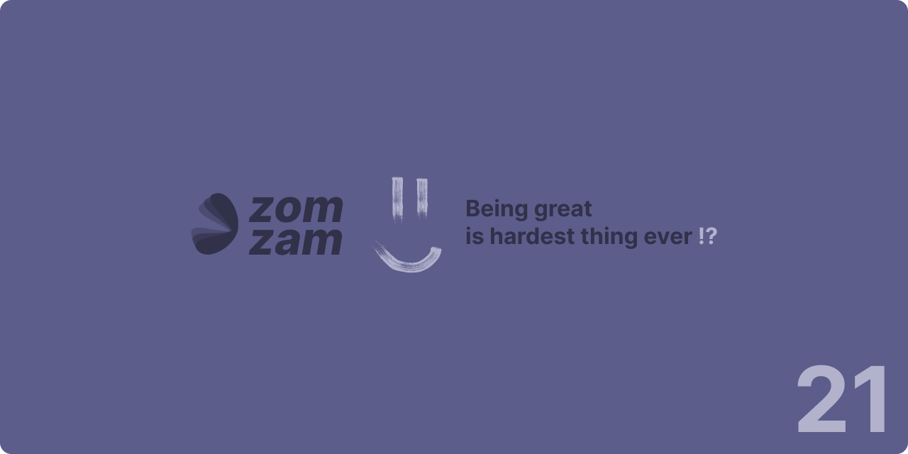

  

<h1 align="center">Ahmed Abdelaziz Hanafy</h1>
<h3 align="center">Distinguished Software Engineer & Systems Architect</h3>

  

  
  
  

---

## 🏛️ Executive Summary

I am a rigorous Software Engineer and technical lead specializing in high-performance computing, complex backend infrastructural design, and intelligent workflow automation. Approaching computational problems with absolute academic precision, I architect highly scalable, API-centric environments and engineer pristine low-level network communications (such as raw WebSockets and TCP protocols). 

As the founder of **zomzam**, I bring an uncompromising, elite standard to the software development lifecycle—ensuring rigid system integrity, robust security models, and world-class, seamless user experiences.

---

## 🔬 Architectural Competencies

  

  

  

### Systems & Languages
- **Backend Mechanics:** TypeScript, Python, PHP, Java, GoLang, SQL
- **Frontend Architecture:** JavaScript, HTML5, CSS3

### Frameworks & Infrastructure
- **Frameworks & Libraries:** Laravel, Django, React, Node.js, Three.js, Chart.js, Android SDK, P5.js, Rive
- **Distributions & Data:** MySQL, PostgreSQL, MongoDB, AWS, Google Cloud Platform (GCP), Digital Ocean
- **Protocols & Design:** RESTful APIs, WebSockets, Webhooks, SSE, OAuth, HTTPS, TCP/IP, Strict MVC Pattern

---

## 💼 Professional Tenure

### **Backend Engineer (Part-Time)** @ SkyLimit LLC
**Remote (USA) • Mar 2022 - Present**
- Architected and orchestrated the comprehensive backend migration of a core enterprise application from a deprecated legacy structure to a highly scalable, maintainable infrastructure.
- Integrated absolute business-critical APIs (Plivo, Twilio, Stripe) ensuring flawless execution of automated communications, secure cryptographic payments, and subscription lifecycles.
- Engineered a pristine bespoke CRM and lead management system supported by an optimized, relationally-perfect database schema, enforcing operational workflow automation.
- Resolved systemic backend bottlenecks within native Text-to-Speech (TTS) services through profound analysis of API payloads and rigorous pipeline logic optimization.

### **PHP Backend Developer / Network Programmer** @ Company for Tech
**Remote (Egypt) • Feb 2024 - Sep 2024**
- Engineered a custom PHP WebSocket server natively from profound first principles to facilitate real-time, ultra-low-latency communication for a high-concurrency client application.
- Independently dictated low-level TCP socket connections and fundamentally implemented the WebSocket protocol (RFC 6455) without reliance on abstracted third-party proxy libraries.
- Forged robust logic architectures managing payload fragmentation, comprehensive message framing, and the flawless reassembly of fragmented data streams.

---

## 🚀 Selected Engineering Works

- **[XGS](https://github.com/zomzam-aar/XGS)** `Python` `⭐ 60` — A highly sophisticated utility engineered to execute rigorous Dorking reconnaissance across standard and deep web (`.onion`) infrastructures.
- **[Fitness-Coach-Website](https://github.com/zomzam-aar/Fitness-Coach-Website)** `HTML/JS/CSS` — A top-tier, seamlessly responsive Arabic platform integrating bespoke membership packages with precise WhatsApp API booking flows.
- **[XCVE](https://github.com/zomzam-aar/XCVE)** `Python` — A specialized security apparatus bridging directly to `CVE.MITRE.ORG` to perform rapid, hyper-accurate vulnerability identification via CVE schemas.
- **[Multi-Region-Tag-Translator-i18n](https://github.com/zomzam-aar/Multi-Region-Tag-Translator-i18n)** `JavaScript/PHP` — An elegant algorithmic solution for internationalization (i18n) executing dynamic, strict multi-region content delivery.
- **[Monster-game](https://github.com/zomzam-aar/Monster-game)** `Java` — A comprehensive software simulation showcasing rigid adherence to robust Object-Oriented Programming (OOP) paradigms and deterministic system architecture.

---

## 🎓 Academic Pursuits

**Alexandria University**  
Bachelor's Degree in Business Information Systems  
📅 Expected Aug 2027  
*Scholastic Focus:* Advanced Database Systems, System Architecture, Corporate Solutions Engineering, and Programmatic Workflow Automation.

---

## 📊 Analytical Metrics

  

  

  

---

## 📫 Direct Communication

  <strong>Prepared to engineer the exceptional.</strong>

  
  
  
  

  <em>"Forging robust infrastructure and pristine design architecture through uncompromising technical rigor."</em>

