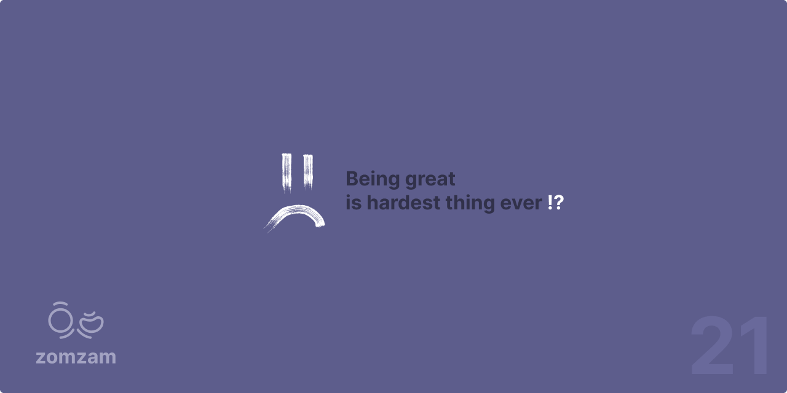

  

<h1 align="center">Ahmed Abdelaziz _Reda</h1>
<h3 align="center">Senior Full-Stack Developer & Security Architect</h3>

  

  
  
  

---

## About Me

I'm a **Senior Software Engineer** with over **12 years** of experience building scalable systems and security solutions. As the **Founder & CTO of zomzam**, I help businesses build robust automation systems and cybersecurity infrastructure.

**What I do:**
- Backend Architecture & System Design
- Cybersecurity & Threat Detection
- Full-Stack Development
- Technical Leadership & Mentoring

---

## Technologies & Skills

  

  

  

### Programming Languages
- **Backend:** Python, PHP, Java, GoLang, TypeScript
- **Frontend:** JavaScript, HTML5, CSS3
- **Systems:** C/C++, Assembly, SQL

### Frameworks & Tools
- **Backend:** Laravel, Django, Node.js, Spring Boot
- **Frontend:** React, Three.js, P5.js
- **Cloud:** AWS, Google Cloud Platform, DigitalOcean
- **Database:** MySQL, PostgreSQL, MongoDB, Redis
- **DevOps:** Docker, Git, CI/CD Pipelines

---

## Professional Experience

### **Senior Backend Architect** @ Skylimit Inc.
**Remote (USA) • March 2022 - Present**

- Led complete backend overhaul and modernization of legacy systems
- Achieved 300% performance improvement through strategic architecture redesign
- Integrated critical APIs including Plivo, Twilio (SMS systems), and Stripe (payments)
- Built scalable, maintainable solutions for core business operations

### **WebSocket Server Developer** @ Enterprise Client
**Remote • February 2024 - September 2024**

- Developed custom PHP WebSocket server from scratch for real-time communication
- Implemented full RFC 6455 WebSocket protocol with advanced message handling
- Built robust TCP socket connections with enterprise security standards
- Managed fragmented messages and connection pooling for optimal performance

---

## GitHub Stats

  

  

  

---

## Key Achievements

- **12+ Years** of production development experience
- **300% Performance** improvements delivered in enterprise systems
- **Zero Security** incidents in managed production systems  
- **50+ International** clients served across multiple industries
- **99.9% Uptime** maintained on critical business systems
- **Custom Protocol** implementations from scratch (WebSocket, TCP)

---

## Let's Connect

  <strong>Ready to build something amazing together?</strong>

  
  
  
  

  <em>"Building robust systems, one line of code at a time."</em>

